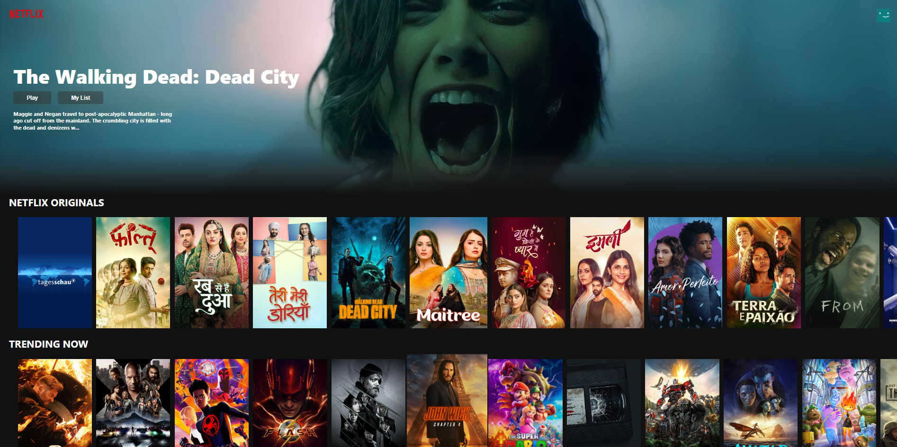

# Netflix Clone

This is a Netflix clone built using [React](https://reactjs.org/), [Redux](https://redux.js.org/), and [Firebase](https://firebase.google.com/). It replicates the basic functionality and design of the popular streaming platform, allowing users to browse movies and TV shows, view details, and sign up for an account.

## Netflix-Clone Link

Here is my [Netflix-Clone](https://netflix-clone-a542d.web.app/) deployed on firebase.

## Features

- User authentication: Sign up, log in, and log out functionality using Firebase Authentication.
- Movie and TV show browsing: Display a collection of movies and TV shows with details such as title, poster, and overview.
- Movie and TV show details: Show additional information when a movie or TV show is selected, including the release year, rating, and cast.
- User login: Allow users to create an account and log in to access personalized features.
- User menu: Provide a user menu to manage account settings and preferences.

## Technologies Used

- React: A JavaScript library for building user interfaces.
- Redux: A predictable state container for managing application state.
- Firebase: A comprehensive development platform that includes authentication, cloud storage, and database services.
- HTML and CSS: Standard web technologies for structuring and styling the application.

## Usage

- Clone the repository: `git clone https://github.com/your-username/netflix-clone.git`
- Navigate to the project directory: `cd netflix-clone`
- Install the dependencies: `npm install`
- Set up Firebase:
  - Create a new project on the [Firebase Console](https://console.firebase.google.com/).
  - Copy the Firebase configuration values from the Firebase project settings.
  - Update the Firebase configuration in the `src/firebase.js` file with your own Firebase configuration values.
- Start the development server: `npm start`
- Open the application in your browser: [http://localhost:3000](http://localhost:3000)

## Contributing

Contributions are welcome! If you have any ideas, improvements, or bug fixes, please open an issue or submit a pull request.

## License

This project is licensed under the [MIT License](LICENSE).

## Community Guidelines ( Code of Conduct )

[Code of Conduct](CODE_OF_CONDUCT.md)

## Security Policy

Go through the [Security Policy](SECURITY.md) of this Project.

